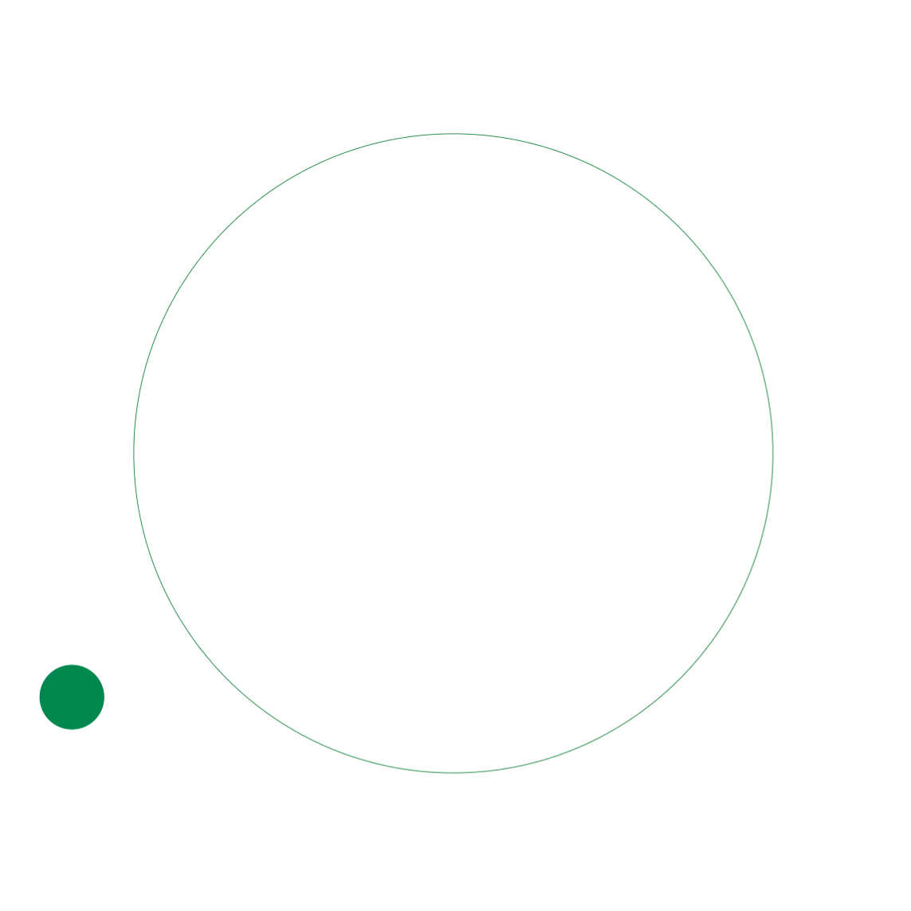
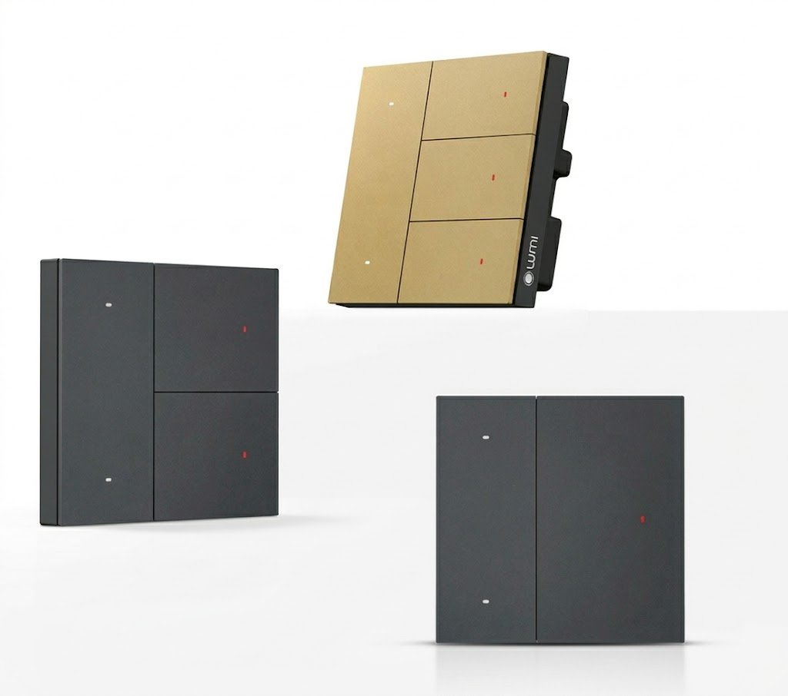
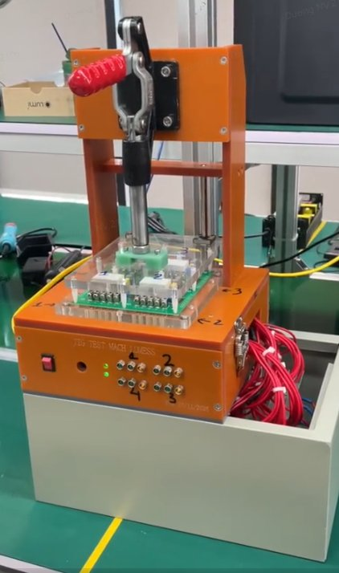
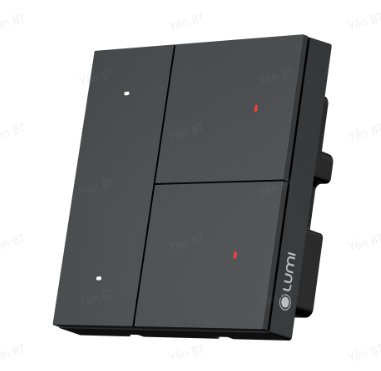
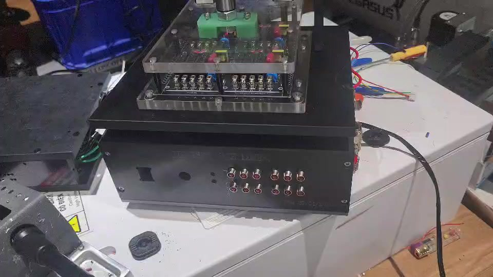
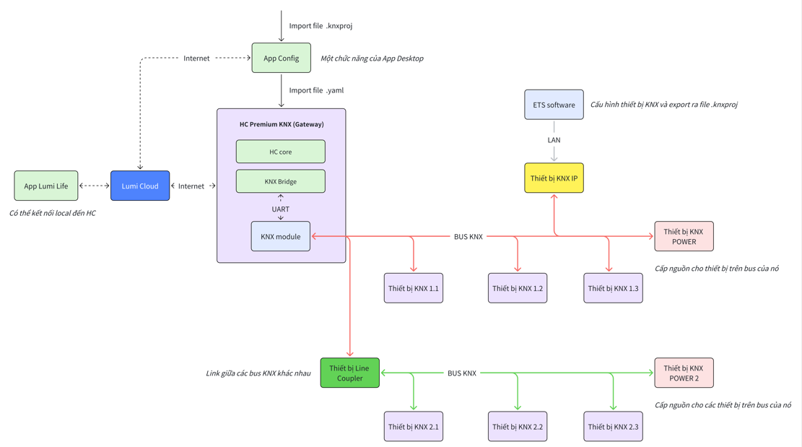
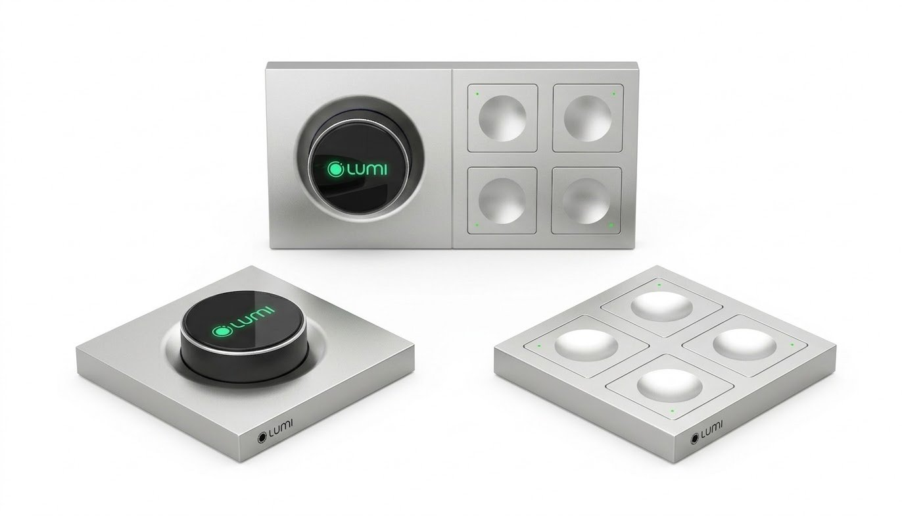
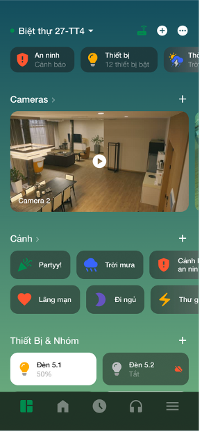
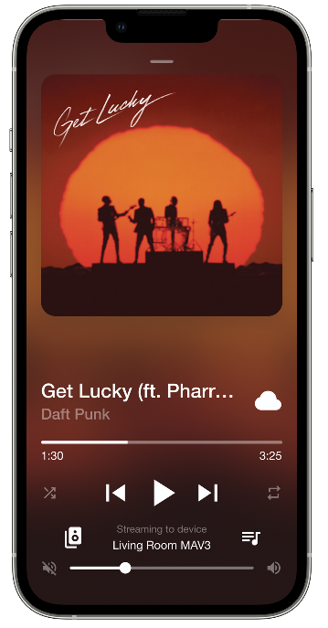

# review_nhan_su_alignment_20260722_202409

- Source: `review_nhan_su_alignment_20260722_202409.pptx`
- Total slides: 17

## Slide 1

REVIEW NHÂN SỰ

Họ và tên: Nguyễn Văn Dương

www.lumi.vn

### Speaker Notes

Xin chào anh chị, đây là phần review nhân sự của Nguyễn Văn Dương. Nội dung tập trung vào kết quả dự án, cách áp dụng AI, phần tự đánh giá và mục tiêu phát triển tiếp theo.

## Slide 2

01.

Các dự án tham gia và kết quả

02.

Sử dụng AI trong công việc

NỘI DUNG

03.

Tự đánh giá ưu, nhược điểm

04.

Mục tiêu sắp tới

### Speaker Notes

Buổi trao đổi gồm bốn phần theo đúng thứ tự trên trang. Trước hết là các dự án và kết quả, sau đó là việc sử dụng AI, tự đánh giá và cuối cùng là mục tiêu sắp tới.

## Slide 3

Dự án tham gia và kết quả

1. Dự án Hội sở MSB

Mục tiêu dự án

Phát triển thiết bị từ công tắc cơ Lumes (nguồn 2 dây)

Bổ sung đo năng lượng & thống kê thời gian chiếu sáng theo từng kênh

Thời gian bắt đầu: 01/11/2025

Thời gian hoàn thành: 21/01/2026

### Speaker Notes

Dự án đầu tiên là dự án Hội sở MSB. Mục tiêu là phát triển thiết bị từ công tắc cơ Lumes, đồng thời bổ sung đo năng lượng và thống kê thời gian chiếu sáng theo từng kênh.

## Slide 4

Dự án tham gia và kết quả

1. Dự án Hội sở MSB

Dev tool jig test cho mạch Lumes

Công việc thực hiện trong dự án

Check các trường hợp mạch không đạt: không giao tiếp được BL0906,

không có ZCD, sai số đo năng lượng lớn, relay không hoạt động

Đo giá trị 12 kênh tải chuẩn phục vụ quá trình Calib

Calib giá trị sai số của mạch và lưu EEPROM

Viết tài liệu hướng dẫn sử dụng Tool Jig, tài liệu đánh giá Tool Jig

Hoàn thành công việc được giao đáp ứng mục tiêu công việc

Các kết quả đạt được

Tuân thủ tiến độ dự án, viết được tài liệu hướng dẫn sử dụng

theo yêu cầu

### Speaker Notes

Trong dự án MSB, các đầu việc chính gồm phát triển Tool Jig, kiểm tra các trường hợp lỗi, đo và hiệu chuẩn, cùng với hoàn thiện tài liệu hướng dẫn. Các công việc đã đáp ứng mục tiêu và tiến độ của dự án.

## Slide 5

Dự án tham gia và kết quả

1. Dự án Hội sở MSB

Horenso, tư duy phản biện để xử lý các lỗi, xảy ra

Các kỹ năng, tư duy áp dụng tốt

Kỹ năng viết báo cáo

Sử dụng AI để lập trình và viết tài liệu

Gặp khó khăn với xử lý đo sai ZCD(nhiễu) do thiếu kinh nghiệm

Những khó khăn gặp phải

– bài học rút ra

Chưa đưa ra hết được các trường hợp fail, cần sự hỗ trợ từ các anh

=> có được kinh nghiệm xử lý các trường hợp ngoại lệ, lường trước

các tình huống thực tế có thể xảy ra

Tài liệu đánh giá mạch:

Các tài liệu đã viết

[MSB Office] Đánh giá mạch Tool Jig test

Tài liệu hướng dẫn sử dụng tool:

[LM-xG2WM] Tài liệu hướng dẫn test sản xuất

### Speaker Notes

Dự án giúp củng cố kỹ năng Horenso, tư duy phản biện, viết báo cáo và sử dụng AI. Khó khăn về nhiễu ZCD và các trường hợp ngoại lệ cũng tạo thêm kinh nghiệm xử lý tình huống thực tế.

## Slide 6

Dự án tham gia và kết quả

2. Dự án Lumes

Thời gian bắt đầu: 31/12/2025

Thời gian hoàn thành: 05/02/2026

Công việc thực hiện trong dự án

Dev tool jig test v2 cho mạch Lumes:

Chuyển đổi giữa 2 sơ đồ mắc 2 dây và 1 dây

Kiểm tra bật tắt relay, chập chân ở cả 2 sơ đồ mắc

Đo chân ZCD trong trường hợp mắc nguồn 2 dây

### Speaker Notes

Tiếp theo là dự án Lumes, tập trung vào Tool Jig test phiên bản hai. Phạm vi gồm chuyển đổi giữa hai sơ đồ mắc, kiểm tra relay và đo ZCD trong cấu hình nguồn hai dây.

## Slide 7

Dự án tham gia và kết quả

2. Dự án Lumes

Các kết quả đạt được

Hoàn thành tất cả công việc được giao

Tuân thủ tiến độ dự án, không bị chậm deadline

Viết tài liệu hướng dẫn, bàn giao Tool Jig

Link tài liệu:

[LUMES]- QUY TRÌNH CHUẨN HÓA & BÀN GIAO JIG/TOOL SẢN XUẤT IOT (MASS PRODUCTION HANDOVER)

### Speaker Notes

Các công việc của dự án Lumes đã được hoàn thành đúng hạn. Tài liệu hướng dẫn và Tool Jig cũng đã được bàn giao để phục vụ sản xuất.

## Slide 8

Dự án tham gia và kết quả

2. Dự án Lumes

Horenso, tư duy phản biện, chủ động báo cáo vấn đề và đề xuất

Các kỹ năng, tư duy áp dụng trong dự án

phương án xử lý

Sử dụng AI trong việc dev và viết tài liệu

Những khó khăn hạn chế gặp phải

Chưa hiểu rõ các thông số cần test

Đến lúc làm mới biết là cần mắc test cả 2 sơ đồ mắc

Cần hỏi rõ ý kiến từ cả 2 phía 2 người làm hardware và firmware

Bài học rút ra

của thiết bị để làm rõ các thông số cần test (a Dũng, a Hoàn)

### Speaker Notes

Điểm tích cực là chủ động báo cáo, đề xuất phương án và sử dụng AI trong phát triển cũng như viết tài liệu. Bài học quan trọng là cần làm rõ thông số test với cả phía hardware và firmware ngay từ đầu.

## Slide 9

Dự án tham gia và kết quả

3. Dự án KNX

Thời gian bắt đầu: 20/11/2026

Thời gian hoàn thành: dự án đang chạy

Mục tiêu dự án:

Phát triển thiết bị KNX riêng cho Lumi

Tích hợp KNX vào hệ thống Lumi và điều khiển

qua App Lumi Life

### Speaker Notes

Dự án KNX hướng tới phát triển thiết bị riêng cho Lumi và tích hợp điều khiển qua ứng dụng Lumi Life. Đây là dự án đang tiếp tục triển khai với phạm vi phối hợp giữa nhiều nhóm.

## Slide 10

Dự án tham gia và kết quả

3. Dự án KNX

Công việc cần thực hiện trong dự án

Porting KNX Stack sang platform Nordic

Phát triển firmware, xử lý phần KNX cho các thiết bị:

Công tắc cảnh 4 nút, Actuator 4 Relay, Rèm, KNOB,

Công tắc cảnh 4 nút + KNX

Tạo file .knxprod cho từng sản phẩm phát triển

Sử dụng phần mềm ETS để cấu hình cho thiết bị

Hỗ trợ tạo file .knxproj trong quá trình test app config

thiết bị

Hỗ trợ team Tester test thiết bị

### Speaker Notes

Các đầu việc KNX bao phủ từ porting stack, phát triển firmware đến tạo file sản phẩm và cấu hình ETS. Ngoài ra còn có nhiệm vụ hỗ trợ App và Tester trong quá trình cấu hình và kiểm thử thiết bị.

## Slide 11

Dự án tham gia và kết quả

3. Dự án KNX

Porting thành công KNX Stack sang platform Nordic (giao tiếp uart và lưu

Các kết quả đạt được

cấu hình KNX vào flash)

Hoàn thành firmware và phần KNX của thiết bị Công tắc 4 nút và

Actuator 4 relay, đã có tính năng secure

Tìm hiểu cách sử dụng AI để tạo file .knxprod cho thiết bị

(cả secure và non-secure)

Tạo thành công file .knxprod cho thiết bị Công tắc cảnh 4 nút,

Actuator 4 relay, Rèm KNX

Sử dụng thành thạo phần mềm ETS để tạo file .knxproj

Bàn giao các file .knxprj (Non Secure, Secure, đủ DPT) cho team App

và team Tester để thực hiện test app config

Làm video hướng dẫn và training trực tiếp cho team Tester cách sử dụng

phần mềm ETS để cấu hình cho thiết bị

### Speaker Notes

Đến nay, KNX Stack đã được port sang nền tảng Nordic và firmware cho một số thiết bị đã hoàn thành. Các file cấu hình, tài liệu hướng dẫn và hoạt động training cũng đã được bàn giao cho các nhóm liên quan.

## Slide 12

Dự án tham gia và kết quả

3. Dự án KNX

Chủ động horeso, làm việc tốt với các team liên quan

Ưu điểm

Sử dụng tốt AI trong việc đọc tài liệu, code, viết tài liệu

Hỗ trợ tốt các team tạo file .knxproj, cung cấp kiến thức, cách sử dụng thiết bị KNX

Chậm deadline, một số task để trôi 1 2 tuần chưa thực hiện được => phải thay đổi

Hạn chế + khó khăn gặp phải

góc nhìn + xin ý kiến từ PM

Thiếu kiến thức về các tính năng của sản phẩm(công tắc, actuator,rèm,…)

Quy trình làm việc giữa các team chưa nắm rõ hết

Sử dụng AI để code nhiều nhưng chưa kiểm soát được hết

Thực hiện chưa tốt việc lên kế hoạch công việc tuần tới

Tồn tại vấn đề chưa xử lý được: chỉ đang nạp được tối đa 5 GA secure

Cải thiện hơn quy trình làm việc giữa các team

Bài học + kế hoạch tiếp theo

Chủ động hơn khi gặp khó khăn

Phân chia thời gian tự review code, kiểm soát chất lượng code tốt hơn

Hoàn thành firmware các thiết bị KNX, xử lý các bug gặp phải

### Speaker Notes

Dự án KNX cho thấy khả năng phối hợp và ứng dụng AI tốt. Tuy nhiên, cần cải thiện việc bám deadline, kiến thức sản phẩm, kiểm soát code do AI hỗ trợ và kế hoạch công việc theo tuần.

## Slide 13

Áp dụng AI trong công việc

Ứng dụng AI:

Hỗ trợ viết code, debug và tối ưu thuật toán, kiến thức về MCU, SDK

Tóm tắt, tra cứu và đọc hiểu tài liệu nhanh

Thu hẹp rào cản ngoại ngữ (dịch, viết, giao tiếp)

Tăng tốc học tập và giải quyết vấn đề

### Speaker Notes

AI đang hỗ trợ trực tiếp cho việc viết và debug code, đọc tài liệu, giảm rào cản ngoại ngữ và tăng tốc học tập. Mục tiêu là dùng AI như công cụ hỗ trợ nhưng vẫn duy trì khả năng kiểm soát kết quả.

## Slide 14

Áp dụng AI trong công việc

Review về kiến trúc dự án

Áp dụng vào dự án cụ thể

Đọc tài liệu datasheet chip, SDK, lên plan và tiến hành code

KNX: datasheet chip NCN5120, đọc tài liệu The KNX Standard, đọc nrf SDK, code, debug

Dev Tool Jig: đọc datasheet BL0906, EEPROM, STM32, code

Lập trình những ngôn ngữ chưa được học (python, xml,…)

Python: phân tích data, thao tác với các file khác trên máy, xử lý file âm thanh,

capture log uart,…

XML: phục vụ tạo file .knxprod

Viết các tài liệu, báo cáo

Viết tài liệu HDSD, áp dụng AI

Hướng dẫn sử dụng speckit: Speckit Guide

Hướng dẫn sử dụng BMAD: BMAD GUIDE

Cuộc thi AI (được sếp trao giải 3): Dương NV

### Speaker Notes

Trong thực tế, AI được dùng để review kiến trúc, đọc datasheet, lên kế hoạch và xử lý dữ liệu bằng các ngôn ngữ mới. AI cũng hỗ trợ viết hướng dẫn sử dụng, tài liệu quy trình và báo cáo.

## Slide 15

Tự đánh giá ưu, nhược điểm

Ưu điểm

Các hạn chế và khó khăn gặp phải

Chuyên môn:

Sử dụng AI nhiều nên không kiểm soát được hết source code

Tìm hiểu nhanh, tiếp cận nhanh với những công nghệ mới

(KNX Stack,…)

(sử dụng AI, đọc datasheet, tài liệu,…)

Nắm được cách hoạt động của các hệ thống, phân tầng

Thiếu kinh nghiệm thực tế, không lường trước được các case

hệ thống, modul hóa khi code

có thể gặp phải (nhiễu khi đo ZCD, điện áp ref UART,

cấu trúc các vùng nhớ trong flash,…)

Làm việc được và hiểu về các giao thức

(UART, I2C, KNX,...)

Chậm deadline, lên kế hoạch làm việc tuần tới chưa tốt

Debug được các case thực tế (nhiễu, sai điện áp

tham chiếu,…)

Kỹ năng mềm:

Thiếu kiến thức chung về các thiết bị

(Công tắc cảnh, rèm, actuator,…)

Tiếp tục cải thiện kỹ năng viết báo cáo, tư duy phản biện

Horenso tốt trong công việc, chủ động làm việc giữa các team

(Tester, Hardware, Software,…)

Hòa nhập được với văn hóa của Lumi trong và ngoài công việc

(thể thao, văn nghệ, MC, game,…)

### Speaker Notes

Điểm mạnh hiện tại là khả năng học nhanh, tư duy hệ thống, làm việc với giao thức và phối hợp giữa các nhóm. Các điểm cần cải thiện là kinh nghiệm thực tế, kiểm soát source code do AI tạo, bám deadline và kiến thức chung về thiết bị.

## Slide 16

Mục tiêu sắp tới

Ngắn hạn (cần thực hiện, cải thiện ngay)

Dài hạn

Hoàn thành các công việc được giao dự án KNX:

Tiếp tục nâng cao tư duy hệ thống nói chung, và hiểu thêm

hệ thống Lumi nói riêng.

Xử lý bug không thêm được nhiều GA secure

Review + refactor code mỗi ngày

Tiếp tục nâng cao kỹ năng sử dụng AI trong công việc

(prompt, xây dựng tài liệu, kiến trúc, skills, workflows,…).

Hoàn thành firmware các thiết bị rèm, KNOB,

Công tắc cảnh + KNOB

Thực hiện việc review code AI mỗi ngày, đảm bảo chất lượng

Thực hiện lên kế hoạch công việc đầy đủ => Nếu chưa biết

code, kiến trúc hệ thống.

phải làn gì tiếp theo cần Horenso hỏi ý kiến PM nhiều hơn

Tiếp tục cải thiện kiến thức chuyên sâu về MCU thông qua

Nắm vững hơn về quy trình làm việc giữa các team

các dự án và đồ án thực tế (các giao thức, thuật toán,

xử lý tín hiệu,…)

### Speaker Notes

Trong ngắn hạn, ưu tiên là hoàn thành các đầu việc KNX, xử lý bug, review code hằng ngày và cải thiện việc lập kế hoạch. Về dài hạn, mục tiêu là nâng cao tư duy hệ thống, kỹ năng AI, chất lượng kiến trúc và kiến thức chuyên sâu về MCU.

## Slide 17

CẢM ƠN!

www.lumi.vn

### Speaker Notes

Phần trình bày đến đây là kết thúc. Cảm ơn anh chị đã theo dõi và mong nhận được góp ý để thống nhất các mục tiêu phát triển trong giai đoạn tiếp theo.
